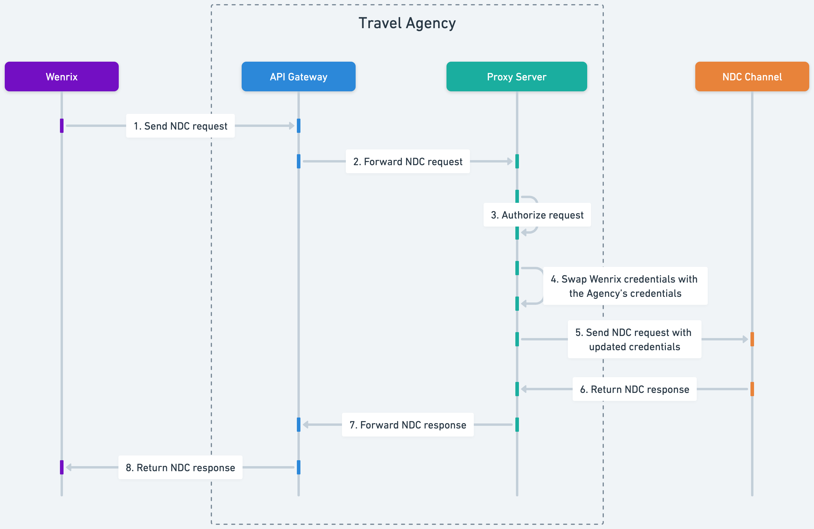

# Wenrix Channel Proxy

[](https://www.docker.com/)
[](https://kubernetes.io/)
[](LICENSE.md)
[](https://openresty.org/)

> **A secure, scalable proxy solution for travel agencies to connect with Wenrix while maintaining complete control over their credentials.**

The Wenrix Channel Proxy is a Docker-based proxy service that enables travel agencies to integrate with multiple airline APIs (GDS, NDC, LCC) without exposing sensitive credentials to third parties. Built on NGINX, it provides secure credential management, request transformation, and seamless connectivity to major airline distribution channels.

---

## Why Channel Proxy?

**Credential Handling, Your Way**: Some agencies are comfortable managing airline API credentials directly, while others prefer to keep them as secure as possible. Whether or not credential sharing is a concern for you, the Channel Proxy gives you full control—your credentials always stay within your environment.

**Our Solution**: By running the Channel Proxy in your own infrastructure, you can seamlessly connect with airline channels without exposing sensitive credentials externally. This approach offers peace of mind for those who prioritize security, and a straightforward integration for everyone else.

### Key Benefits

- **🔒 Enhanced Security**: Credentials remain in your environment - never shared
- **⚡ High Performance**: Built on NGINX for minimal latency and maximum throughput
- **📈 Scalable**: Kubernetes-ready with auto-scaling and load balancing
- **🔧 Easy Integration**: RESTful API with comprehensive documentation
- **📊 Observable**: Built-in metrics, logging, and health checks
- **🌐 Multi-Channel**: Support for multiple airline channels out of the box

---

## Table of Contents

- [Supported Channels](#supported-channels)
- [Quick Start](#quick-start)
- [Integration Guide](#integration-guide)
- [Deployment Options](#deployment-options)
- [Environment Variables](#environment-variables-reference)
- [Configuration Examples](#configuration-examples)
- [Security & TLS](#security--tls)
- [Monitoring & Health Checks](#monitoring--health-checks)
- [Support](#support)

---

## Supported Channels

| Channel | Type | Endpoints | Features |
|---------|------|-----------|----------|
| **TravelFusion** | GDS Aggregator | `/channel/travelfusion/*` | XML credential swapping, supplier parameters |
| **British Airways** | Airline NDC | `/channel/britishairways/*` | API key management, header transformation |
| **Farelogix AA** | NDC Platform | `/channel/farelogix-aa/*` | American Airlines integration |
| **Farelogix LH** | NDC Platform | `/channel/farelogix-lh/*` | Lufthansa Group integration |
| **Farelogix UA** | NDC Platform | `/channel/farelogix-ua/*` | United Airlines integration |

> **Need another channel?** Additional integrations can be added with minimal configuration. Contact our team for custom channel support.

---

## Quick Start

### Prerequisites
- Docker 20.0+ or Kubernetes 1.19+
- Valid airline channel credentials
- Network access to airline APIs

### Get Started in 2 Minutes

```bash
# Run with basic configuration for Farelogix AA
# (Docker will automatically pull the image if not present)
docker run -d \
  --name channel-proxy \
  -p 8080:8080 \
  -e WP_SERVER_PORT=8080 \
  -e WP_CHANNELS_FARELOGIX_AA_API_KEY="your-aa-api-key" \
  -e WP_CHANNELS_FARELOGIX_AA_USERNAME="your-username" \
  -e WP_CHANNELS_FARELOGIX_AA_PASSWORD="your-password" \
  public.ecr.aws/wenrix/wenrix-channel-proxy:latest
```

### Verify Installation

```bash
# Health check
curl http://localhost:8080/
# Response: Welcome to Wenrix Proxy

# Metrics endpoint
curl http://localhost:8080/metrics
```

> **Want to build from source?** See [Deployment Options](#deployment-options) for comprehensive setup guides.

---

## Integration Guide

### How It Works



### Integration Steps

> **First**, choose your [deployment method](#deployment-options) - pre-built image for speed or build from source for customization.

#### 1. **Configure Your Channels**

Each channel requires specific credentials and configuration ([Environment Variables Reference](#environment-variables-reference)):

**TravelFusion Example (.env file):**
```bash
# Create .env file
WP_CHANNELS_TRAVELFUSION_LOGIN_ID=your-login-id
WP_CHANNELS_TRAVELFUSION_XML_LOGIN_ID=your-xml-login-id
WP_CHANNELS_TRAVELFUSION_SUPPLIER_PARAMETERS={"12345678": {"airfranceklm": {"AgentLogin": "YourAgent", "AgentIATANumber": "12345678", "AgentIdentifier": "ABCD"}}}
```

> **Note**: The `SUPPLIER_PARAMETERS` JSON is written to `tf_config.json` at startup and loaded by the Lua script for credential mapping.

**Farelogix American Airlines Example (.env file):**
```bash
# Create .env file
WP_CHANNELS_FARELOGIX_AA_API_KEY=your-aa-api-key
WP_CHANNELS_FARELOGIX_AA_AGENT=your-agent-id
WP_CHANNELS_FARELOGIX_AA_USERNAME=your-username
WP_CHANNELS_FARELOGIX_AA_PASSWORD=your-password
WP_CHANNELS_FARELOGIX_AA_AGENT_USER=your-agent-user
WP_CHANNELS_FARELOGIX_AA_AGENT_PASSWORD=your-agent-password
```

#### 2. **Test Integration**

Example API calls to verify your configuration (replace with actual API formats):

```bash
# Test TravelFusion (replace with actual TravelFusion API XML format)
curl -X POST http://localhost:8080/channel/travelfusion/your-api-endpoint \
  -H "Content-Type: text/xml" \
  -H "x-wenrix-iata-number: your-iata-number" \
  -H "x-wenrix-supplier: your-supplier-name" \
  -d '<YourTravelFusionRequest><LoginId>PLACEHOLDER</LoginId><XmlLoginId>PLACEHOLDER</XmlLoginId></YourTravelFusionRequest>'

# Test Farelogix AA (replace with actual American Airlines XML request)
curl -X POST http://localhost:8080/channel/farelogix-aa/your-api-endpoint \
  -H "Content-Type: application/xml" \
  -d '<AARequest><Authentication><Username>#FLX_USERNAME#</Username><Password>#FLX_PASSWORD#</Password><Agent>#FLX_AGENT#</Agent></Authentication></AARequest>'
```

#### 3. **Production Deployment**

For production deployment, see the detailed [Deployment Options](#deployment-options) section below.

---

## Deployment Options

### Option 1: Deploy Pre-built Images

**Advantages:**
- ✅ Fastest deployment time
- ✅ Wenrix-tested and validated
- ✅ Automatic security updates
- ✅ Production-ready configuration

**Use Cases:**
- Standard channel integrations
- Quick proof-of-concepts
- Production deployments with standard requirements

**Docker Deployment:**
```bash
# Production deployment with Docker
docker run -d \
  --name channel-proxy \
  --restart unless-stopped \
  -p 8080:8080 \
  --env-file .env \
  public.ecr.aws/wenrix/wenrix-channel-proxy:latest
```

### Option 2: Build from Source

**Advantages:**
- ✅ Complete source control
- ✅ Custom modifications possible
- ✅ Internal security compliance
- ✅ Custom channel additions

**Use Cases:**
- Custom channel integrations
- Enhanced security requirements
- Specific infrastructure constraints
- Advanced customization needs

**Build and Deploy Process:**
```bash
# Clone repository
git clone https://github.com/wenrix/channel-proxy.git
cd channel-proxy

# Build the image
./build.sh

# For local development/testing
docker-compose up -d

# For Kubernetes deployment with Helm
helm install channel-proxy deployment/helm/chart/ \
  --values your-custom-values.yaml
```

---

## Environment Variables Reference

### Server Configuration

| Variable | Required | Default | Description |
|----------|----------|---------|-------------|
| `WP_SERVER_PORT` | No | `8080` | HTTP listening port |
| `WP_SERVER_RESOLVER` | No | `8.8.8.8` | DNS resolver for upstream hosts |
| `WP_SERVER_DEBUG` | No | `false` | Enable debug logging |

### Security & Authentication

| Variable | Required | Default | Description |
|----------|----------|---------|-------------|
| `WP_SERVER_HTTP_USER` | No | - | Basic auth username |
| `WP_SERVER_HTTP_PASS` | No | - | Basic auth password |
| `WP_SERVER_TLS_ENABLED` | No | `false` | Enable TLS/SSL |
| `WP_SERVER_TLS_PORT` | No | `18443` | HTTPS listening port |
| `WP_SERVER_TLS_CERTIFICATE` | If TLS | - | Base64-encoded certificate |
| `WP_SERVER_TLS_CERTIFICATE_KEY` | If TLS | - | Base64-encoded private key |

### TravelFusion Channel

| Variable | Required | Default | Description |
|----------|----------|---------|-------------|
| `WP_CHANNELS_TRAVELFUSION_LOGIN_ID` | Yes | - | Your TravelFusion login ID |
| `WP_CHANNELS_TRAVELFUSION_XML_LOGIN_ID` | Yes | - | Your XML login ID |
| `WP_CHANNELS_TRAVELFUSION_HOST` | No | `api.travelfusion.com` | TravelFusion API host |
| `WP_CHANNELS_TRAVELFUSION_SUPPLIER_PARAMETERS` | Yes | - | JSON mapping of IATA numbers to supplier credentials (written to tf_config.json) |

### British Airways Channel

| Variable | Required | Default | Description |
|----------|----------|---------|-------------|
| `WP_CHANNELS_BA_API_KEY` | Yes | - | Your BA API key |
| `WP_CHANNELS_BA_HOST` | No | `api.ba.com` | BA API host |
| `WP_CHANNELS_BA_MERCHANT_ID` | No | - | BA merchant identifier |

### Farelogix Channels

Each Farelogix channel (AA, LH, UA) uses similar variables:

| Variable Pattern | Description |
|------------------|-------------|
| `WP_CHANNELS_FARELOGIX_[AIRLINE]_HOST` | API host |
| `WP_CHANNELS_FARELOGIX_[AIRLINE]_API_KEY` | Subscription key |
| `WP_CHANNELS_FARELOGIX_[AIRLINE]_AGENT` | Agent identifier |
| `WP_CHANNELS_FARELOGIX_[AIRLINE]_USERNAME` | Username |
| `WP_CHANNELS_FARELOGIX_[AIRLINE]_PASSWORD` | Password |
| `WP_CHANNELS_FARELOGIX_[AIRLINE]_AGENT_USER` | Agent user |
| `WP_CHANNELS_FARELOGIX_[AIRLINE]_AGENT_PASSWORD` | Agent password |

Replace `[AIRLINE]` with `AA`, `LH`, or `UA`.

---

## Configuration Examples

### Complete .env File Example

```bash
# Server Configuration
WP_SERVER_PORT=8080

# Farelogix American Airlines
WP_CHANNELS_FARELOGIX_AA_API_KEY=your-aa-api-key
WP_CHANNELS_FARELOGIX_AA_AGENT=your-agent-id
WP_CHANNELS_FARELOGIX_AA_USERNAME=your-username
WP_CHANNELS_FARELOGIX_AA_PASSWORD=your-password
WP_CHANNELS_FARELOGIX_AA_AGENT_USER=your-agent-user
WP_CHANNELS_FARELOGIX_AA_AGENT_PASSWORD=your-agent-password
```

### TravelFusion Supplier Parameters

The `WP_CHANNELS_TRAVELFUSION_SUPPLIER_PARAMETERS` environment variable should contain JSON mapping your IATA numbers to supplier-specific credentials:

**Format (.env file):**
```bash
WP_CHANNELS_TRAVELFUSION_SUPPLIER_PARAMETERS={"IATA_NUMBER": {"SUPPLIER_NAME": {"Key1": "Value1", "Key2": "Value2"}}}
```

**Example:**
```bash
WP_CHANNELS_TRAVELFUSION_SUPPLIER_PARAMETERS={"12345678": {"airfranceklm": {"AgentLogin": "YourAgent", "AgentIATANumber": "12345678", "AgentIdentifier": "ABCD"}}}
```

Replace:
- `12345678` with your IATA number
- `airfranceklm` with the supplier name (provided by TravelFusion)
- The credentials with values specific to your TravelFusion setup

---

## Security & TLS

### TLS Configuration

Enable HTTPS for production deployments:

```bash
# Add to .env file
WP_SERVER_TLS_ENABLED=true
WP_SERVER_TLS_CERTIFICATE=<base64-encoded-certificate>
WP_SERVER_TLS_CERTIFICATE_KEY=<base64-encoded-private-key>

# Generate base64 values (Linux/macOS):
# base64 -w 0 cert.crt
# base64 -w 0 cert.key
```

### Basic Authentication

Protect your proxy with HTTP Basic Auth:

```bash
# Add to .env file
WP_SERVER_HTTP_USER=admin
WP_SERVER_HTTP_PASS=secure-random-password
```

### Security Best Practices

1. **Use HTTPS in Production**: Always enable TLS for production deployments
2. **Rotate Credentials Regularly**: Update API keys and passwords periodically
3. **Limit Network Access**: Use firewall rules to restrict proxy access
4. **Monitor Access Logs**: Review logs for suspicious activity
5. **Use Secrets Management**: Store sensitive data in Kubernetes secrets or equivalent

---

## Monitoring & Health Checks

### Built-in Endpoints

| Endpoint | Purpose | Response |
|----------|---------|----------|
| `GET /` | Health check | `Welcome to Wenrix Proxy` |
| `GET /metrics` | Infrastructure monitoring | [NGINX connection statistics](https://nginx.org/en/docs/http/ngx_http_stub_status_module.html) (for ops teams) |

### Health Check Examples

```bash
# Basic health check
curl http://localhost:8080/
# Expected: 200 OK, "Welcome to Wenrix Proxy"

# Infrastructure stats (for ops/monitoring tools)
curl http://localhost:8080/metrics
# Expected: Basic NGINX connection counts and server statistics
```

## Support

### Getting Help
For technical issues, configuration help, or troubleshooting assistance, contact **support@wenrix.com** or reach out to your **dedicated Wenrix squad** for personalized help.

### Contributing

We welcome contributions!

1. Fork the repository
2. Create a feature branch
3. Make your changes
4. Add tests
5. Submit a pull request

---

## License

This project is licensed under the MIT License - see the [LICENSE.md](LICENSE.md) file for details.
